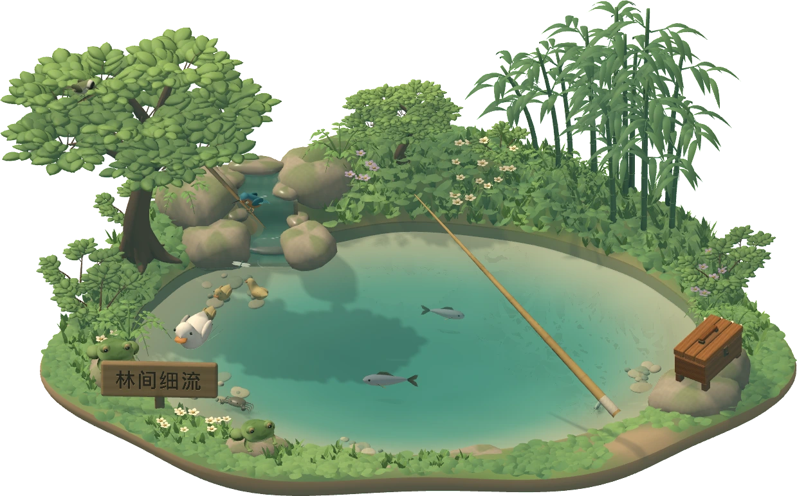

# Moyu

A little piece of nature on your Mac desktop.

Cast a line between things. Watch the float, play a heavier fish, and discover the creatures and small surprises waiting beneath the water.

## Overseas public beta

Version **0.78.1** (build 110). **Apple Silicon · macOS 26 or later**. Intel Macs, Windows and older macOS versions are not supported by this build.

The download is being prepared. The release will appear in [Releases](https://github.com/chengandy1120-coder/moyu/releases) after Apple notarization and package verification are complete.

## What you can play

- A transparent, resizable 3D fishing scene alongside your other apps.
- Jiangnan's woodland stream, different casting spots, bait and tackle.
- Rod tension and fish struggles, quiet water, wind and leaves.
- A creature field guide, local collections and drift-bottle letters.
- English by default, with Simplified Chinese under **More → Language / 更多 → 语言**. Reel in before switching languages.

Only Jiangnan is currently playable. Norway and Florida are planned waters; their previews do not represent playable areas.

## Getting started

Cast from the rod grip. Lift when the float signals a bite. Follow the game's guide to reel in while managing a heavier fish's pull. Right-click the scene for tackle, field guide, sound and scene size.

Your collection and settings are stored locally on your Mac. Updating the application should preserve them; do not reset your game profile when updating. This beta has no automatic updater.

## Feedback

Please report bugs in [Issues](https://github.com/chengandy1120-coder/moyu/issues), with the app version, macOS version, Mac model and steps to reproduce. Review screenshots before posting; avoid including personal desktop content or your save files.

[Official website](https://moyu-little-waters.pages.dev/)

## Distribution and artwork

This repository contains release information and public download assets. Game source code is not published here. No open-source licence is granted for the game. Third-party materials retain their own licences; see [ATTRIBUTIONS.md](ATTRIBUTIONS.md) and **More → About Moyu → Sources and credits** in the game.
